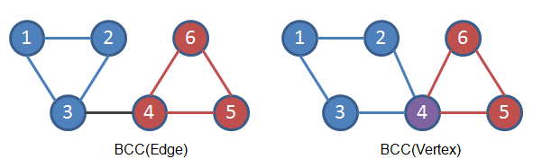

.. _graph:

*************
Graph
*************

.. _graphd:

Graph
=====

.. code-block:: cpp

  int const N = 100010;
  int const M = 1000010;
  struct Edges {
    int u, next;
  } e[M];
  int p[N], idx;
  void init() { clr(p, 0xff); idx = 0; }
  void addedge(int u, int v) { e[idx].u = v, e[idx].next = p[u], p[u] = idx++; }

.. _cut_vertex_and_bridge:

Cut-Vertex and Bridge
=====================

.. code-block:: cpp

	//+ DSU/Stack to maintain the size of each component
	//* Cut-Vertex: (u) if (sc[u] > 1)
	//* Cut-Bridge: (u, v) if (low[v] > dfn[u]) *warning: parallel_edges
	struct CutVertex {
	  int dfn[N], low[N], sc[N], cnt;
	  void dfs(int u, int ori, int pre) {
	    dfn[u] = low[u] = ++cnt;
	    for (int i = p[u]; ~i; i = e[i].next) {
	      int v = e[i].u;
	      if (!dfn[v]) {
	        dfs(v, ori, i);
	        low[u] = min(low[u], low[v]);
	        if (low[v] >= dfn[u]) ++sc[u];
	      }
	      else if ((i ^ 1) != pre) { // ensure (e[(u, v)] ^ e[(v, u)]) == 1
	        low[u] = min(low[u], dfn[v]);
	      }
	    }
	    if (u != ori) ++sc[u];
	  }
	  void solve() {
	    cnt = 0, clr(dfn, 0), clr(sc, 0);
	    Rep(i, n) if (!dfn[i]) dfs(i, i, -1);
	  }
	};

.. _bcc:

BCC
=====================

.. code-block:: cpp

	// BCC(Edge)
	int col[N], cc; // clr(col, 0), cc = 0;
	void dfs(int u) {
	  if (!col[u]) col[u] = ++cc;
	  for (int i = p[u]; ~i; i = e[i].next) {
	    int v = e[i].u;
	    if (!col[v]) {
	      if (cv.low[v] > cv.dfn[u]) col[v] = ++cc;
	      else col[v] = col[u];
	      dfs(v);
	    }
	  }
	}
	// BCC(Vertex)
	bool vis[N]; // clr(vis, 0);
	int col[M], cc; // clr(col, 0), cc = 0;
	void dfs(int u, int pc) {
	  vis[u] = 1;
	  for (int i = p[u]; ~i; i = e[i].next) {
	    if (!col[i]) {
	      int v = e[i].u;
	      if (cv.low[v] >= cv.dfn[u]) col[i] = col[i ^ 1] = ++cc;
	      else col[i] = col[i ^ 1] = pc;
	      if (!vis[v]) dfs(v, col[i]);
	    }
	  }
	}